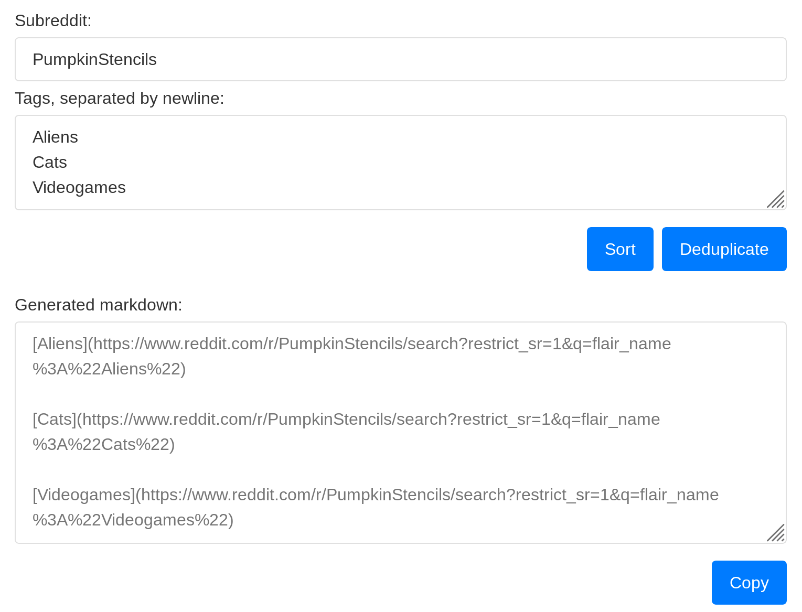

# Tag Search Link Generator

<a href="https://travis-ci.org/AlbinoDrought/tag-search-link-generator"></a>
<a href="https://github.com/AlbinoDrought/tag-search-link-generator/blob/master/LICENSE">
  
</a>

Easily generate a list of links for searching a subreddit by tags. [Try it out!](https://albinodrought.github.io/tag-search-link-generator/)

[](https://albinodrought.github.io/tag-search-link-generator/)

## Building

```sh
npm install
npm run build
```
